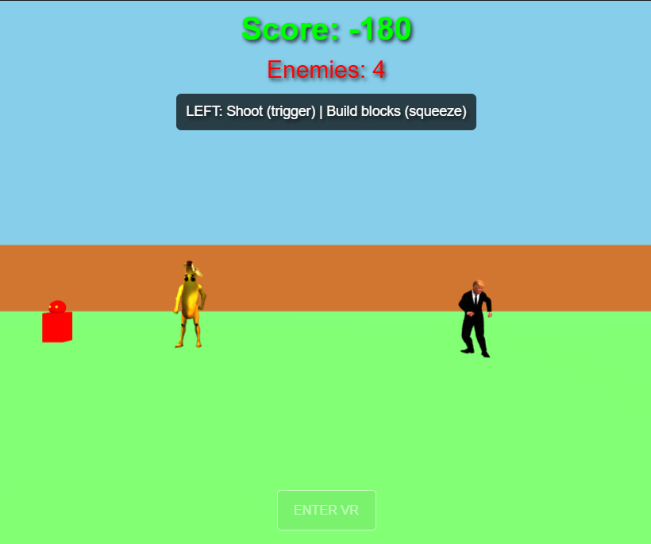

# VR Defense Game

Juego de VR para gafas WebXR donde defiendes tu posición contra enemigos que te persiguen, usando un arma en la mano izquierda y construyendo defensas. Además, incluye 2 animaciones 3D descargadas de Sketchfab.

**Sandbox original:** https://codesandbox.io/p/sandbox/s12-forked-jdqgpg

## Controles VR

**Mano izquierda:**
- Línea roja para apuntar
- **Trigger:** disparar balas
- **Squeeze:** construir bloques con raycast

## Sistema de juego

- **Enemigos:** aparecen periódicamente (máx. 8), persiguen al jugador y tienen 3 puntos de vida.
- **Combate:** balas con física, detección de colisión (distancia < 0.7) y feedback visual al impactar.
- **Puntuación:** +10 por matar enemigo, -10 si te alcanza.
- **Construcción:** bloques de colores aleatorios que bloquean el paso de los enemigos.

## Elementos visuales

- 2 modelos 3D animados de Sketchfab:
  - Banana con baile de Fortnite (cargada en local, `public/banana_fortnite.glb`).
  - Trump bailando (cargado en tiempo real desde [`Mengfeidai1031/IG-S12`](https://github.com/Mengfeidai1031/IG-S12) vía Git LFS, por el tamaño del archivo).
- Explosiones de partículas al destruir enemigos.
- Flash del disparo.
- Arena cerrada con muros y cielo.

## Stack

Three.js · WebXR · JavaScript
